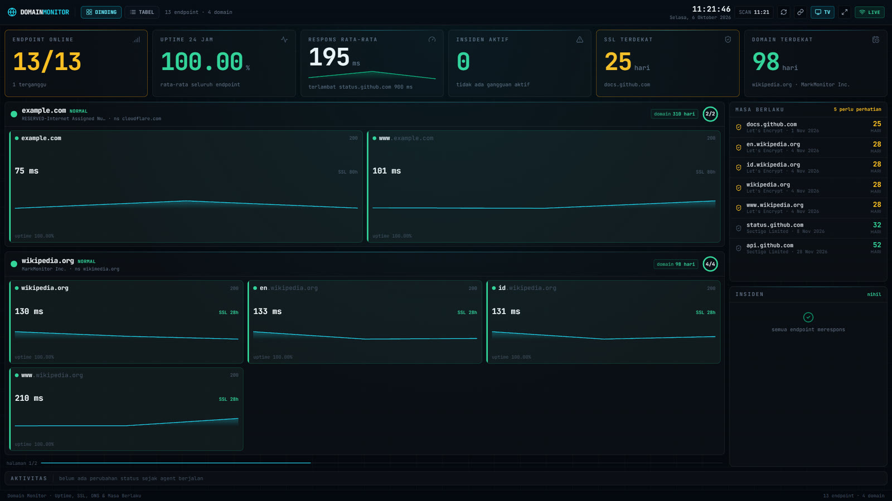
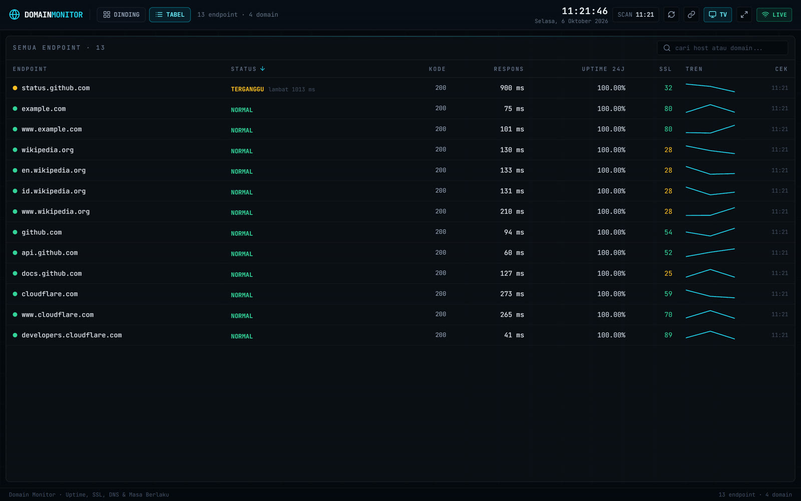
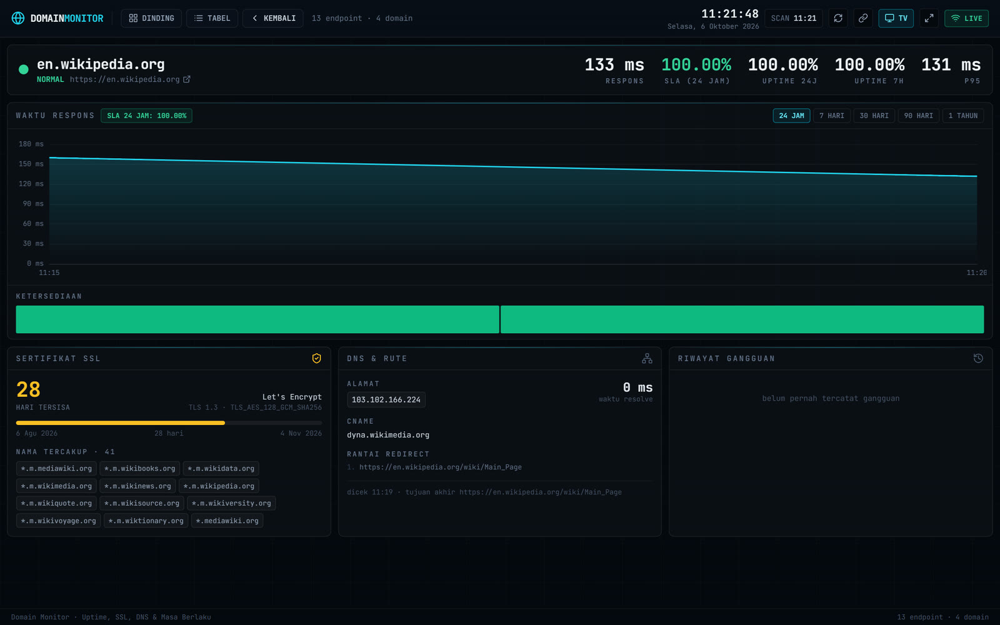
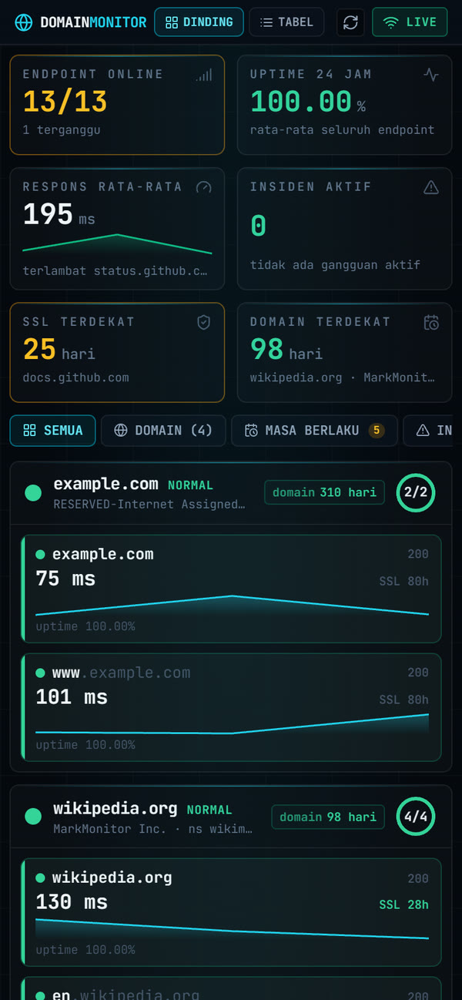

# Domain Monitor

A wall dashboard for domains and subdomains, built for the TV in a NOC. It shows uptime, response time, SSL certificate expiry, DNS resolution and domain registration expiry.

One Go agent checks everything from the outside, keeps its history in embedded SQLite and pushes live updates over WebSocket. A Vue 3 dashboard turns that into three views: a TV wall, a dense table and a per-endpoint detail page.



| Table | Endpoint detail |
| :--- | :--- |
|  |  |

<p align="center"></p>

**Stack:** Go · SQLite (`modernc.org/sqlite`, pure Go) · WebSocket · Vue 3 · Vite · TypeScript · Tailwind CSS · Apache ECharts · Nginx · Docker

---

## Why it is built this way

- **One agent for every domain.** Nothing is installed on the sites being watched. Every check is made from outside: an HTTP request, a TLS handshake, a DNS query and a registry lookup.
- **The backend decides the status.** The wall, the table and the detail page can never disagree about what "degraded" means, because there is only one classifier.
- **Survives restarts.** History lives in embedded SQLite, so uptime percentages and incidents are kept. There is still no database server, and the agent is still a single static binary (`CGO_ENABLED=0`).
- **TV first.** No scrolling, nothing that only appears on hover, and no endpoint is ever hidden. When space runs out, tiles rotate instead of being cut off.
- **Calm by default.** Latency is judged on a moving average of the last three samples, and an incident opens only after consecutive failures. A wall that flickers amber teaches people to ignore amber.

```
                        ┌──────────────────────────────┐
                        │        CENTRAL SERVER        │
   TV on the wall ◄──── │  Nginx  →  dist/ (Vue 3)     │
                        │      ↕ /api/v1  /ws/v1       │
                        │  domain-monitor (Go, :9292)  │
                        │   ├─ scheduler + worker pool │
                        │   ├─ SQLite  /data/*.db      │
                        │   └─ WebSocket hub           │
                        └───────────────┬──────────────┘
                                        │ outbound probes
        ┌───────────────┬───────────────┼───────────────┐
        ▼               ▼               ▼               ▼
   HTTP(S) GET     TLS handshake     DNS query      RDAP / WHOIS:43
   status+latency  cert NotAfter     A/AAAA/NS      domain expiry
```

---

## Quick start

Requirements: Go 1.25+ and Node.js 18+.

```bash
# Agent (terminal 1)
cd backend && go run ./cmd/agent --targets ../list-domain.txt --db ./data/dev.db

# Dashboard (terminal 2)
cd frontend && npm install && npm run dev
```

Open `http://localhost:3001/?view=wall`. Vite proxies `/api` and `/ws` to the agent on `:9292`.

The repository ships with a small list of public sites so the dashboard has something to show straight away.

### Docker Compose

```bash
cp .env.example .env     # adjust ports and thresholds if needed
cd frontend && npm ci && npm run build && cd ..
make docker-up
```

The dashboard is served on `http://<server>:8082/?view=wall`. History is kept in the named volume `domain-monitor-data`, so `docker compose down` does not erase uptime or incidents. Changes to `.env` only need `make docker-restart`.

A systemd unit for running without Docker is in [`deploy/systemd`](deploy/systemd).

---

## Targets

`list-domain.txt` is the single list of targets, edited by hand:

```text
domain: example.com
subdomain: www.example.com, https://status.example.com
```

- A `domain:` line opens a group and the `subdomain:` line fills it.
- The scheme is optional; a bare host is treated as `https://`.
- The apex domain is monitored as an endpoint too, and is the one looked up in the registry.
- **The file is re-read within 30 seconds of a change**, so adding a subdomain needs no restart.

## Views

| URL | For |
| :--- | :--- |
| `?view=wall` | **The TV.** KPIs, a panel per domain, the expiry watchlist, incidents and an activity ticker. |
| `?view=list` | A dense, sortable and searchable table of every endpoint, for a desk. |
| `?view=detail&target=<host>` | Response time (24 h / 7 d / 30 d / 90 d / 1 y), availability bars, certificate, DNS and incident history. |

The view lives in the query string, so each screen can be pinned to its own URL. From 2560 px wide the interface scales up 1.5× so it stays readable on a 4K panel from across the room.

## Incidents and expiry

- An incident opens after **two consecutive failures** (`FAIL_THRESHOLD`) and closes on the first success.
- An incident still open when the agent stops is **resumed** after a restart rather than duplicated.
- Certificate and registration expiry share one list, soonest first: the only question is what runs out next.
- Registration lookups try **RDAP** first and fall back to **WHOIS on port 43** (server discovered through `whois.iana.org`) for TLDs without RDAP.
- **Optional webhook alerts.** Downtime and recovery are batched and posted to `WEBHOOK_URL`, for example an n8n workflow that screenshots the wall and forwards it to Telegram or WhatsApp. Off by default.

## Configuration

Everything is set through environment variables; see [`.env.example`](.env.example).

| Variable | Default | Meaning |
| :--- | :--- | :--- |
| `HTTP_ADDR` | `:9292` | Agent listen address |
| `TARGETS_FILE` | `../list-domain.txt` | Target list |
| `DB_PATH` | `./data/domain-monitor.db` | SQLite history file |
| `HTTP_INTERVAL` / `TLS_INTERVAL` | `60s` / `6h` | Availability / certificate checks |
| `DNS_INTERVAL` / `RDAP_INTERVAL` | `15m` / `12h` | DNS / registration lookups |
| `PROBE_CONCURRENCY` | `8` | Checks running at once |
| `LATENCY_WARN_MS` / `LATENCY_CRIT_MS` | `800` / `2000` | Slow / very slow |
| `CERT_WARN_DAYS` / `CERT_CRIT_DAYS` | `30` / `14` | Certificate warnings |
| `DOMAIN_WARN_DAYS` / `DOMAIN_CRIT_DAYS` | `60` / `30` | Registration warnings |
| `ACCEPT_STATUS` | `401,403` | Non-2xx codes that still count as healthy |
| `FAIL_THRESHOLD` | `2` | Consecutive failures before an incident opens |
| `RETENTION_DAYS` | `30` | How long raw checks are kept |
| `API_TOKEN` | empty | Optional bearer token |
| `WEBHOOK_ENABLED` | `false` | Post incidents to `WEBHOOK_URL` |

`ACCEPT_STATUS` exists because many API and CDN roots answer `401`, `403` or `404` by design. Without it those hosts would sit amber forever. Add `404` for hosts that genuinely have no page at `/`.

## API

```
GET  /api/v1/health                        # public, no token
GET  /api/v1/config                        # thresholds the backend is using
GET  /api/v1/overview                      # KPIs for the top of the wall
GET  /api/v1/domains                       # grouped by apex domain
GET  /api/v1/targets                       # flat, every endpoint
GET  /api/v1/targets/{id}                  # one endpoint + incident history
GET  /api/v1/targets/{id}/history?range=24h|7d|30d
GET  /api/v1/incidents?active=true&limit=50
GET  /api/v1/expiry                        # SSL + domain, soonest first
GET  /api/v1/events                        # latest status transitions
POST /api/v1/recheck                       # force a recheck
GET  /ws/v1                                # snapshot on connect, then deltas
```

When `API_TOKEN` is set, every endpoint except `/health` needs `Authorization: Bearer <token>`. The WebSocket takes it as `?token=`, since browsers cannot send headers on the handshake.

## Tests

```bash
cd backend && go test ./...     # parsers, incident state machine, RDAP/WHOIS dates, SQL rollups, routing
cd frontend && npm run build    # vue-tsc type-check + production build
```

The dashboard's interface text is in Indonesian.

## License

[MIT](LICENSE) © Radhian Sobarna
